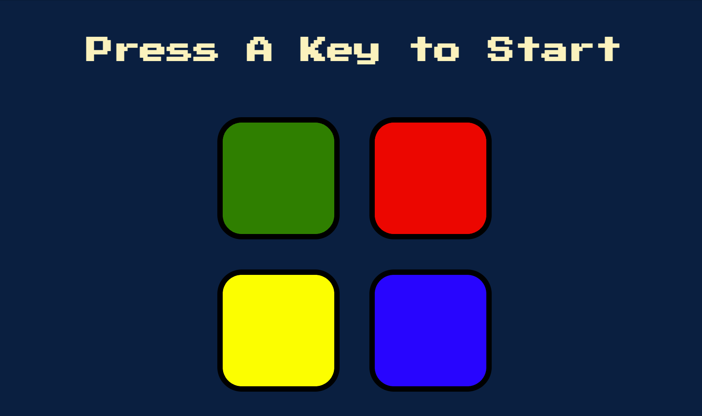

<h1>Simon game 🕹️</h1>

This is a simple Simon Game project built using JavaScript and jQuery. This project is a challenge I've completed in the course <a href="https://www.udemy.com/course/the-complete-web-development-bootcamp/?src=sac&kw=the+complete+2023" target="_blank">"The Complete 2023 Web Development Bootcamp"</a>  by Angela Yu.

The game consists of building a sequence of buttons. Upon start, the game shows a button and you have to click on it. Then, it shows the next button of the sequence and you must click on the first and then on the second button, and so on, always repeating the sequence from the top. If you get the sequence wrong, an error message is displayed and the game is over.

<h2>How it looks</h2>

<h2>Languages ant tools 👩🏽‍💻</h2> 
<ul>
    <li>HTML 5;</li>
    <li>CSS 3;</li>
    <li>JavaScript;</li>
    <li>jQuery.</li>
</ul>

<h2>Skills learned 💪🏽</h2>
<ul>
    <li>JavaScript variables, arrays and functions;</li>
    <li>Manipulating elements, classes, text and functions and building animations using jQuery.</li>
</ul>